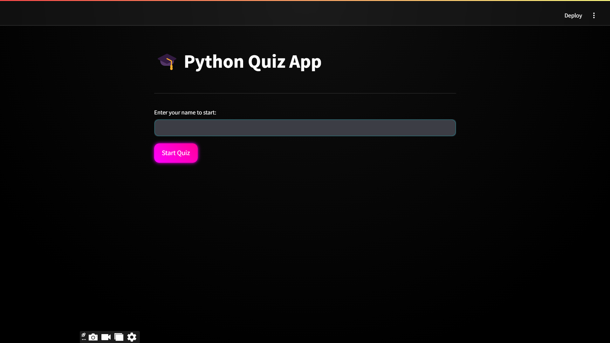
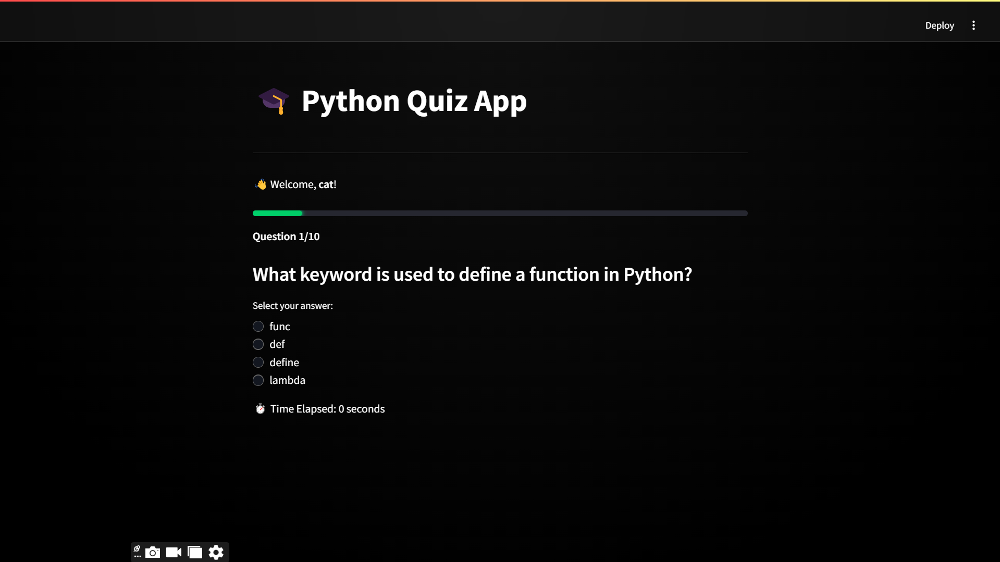
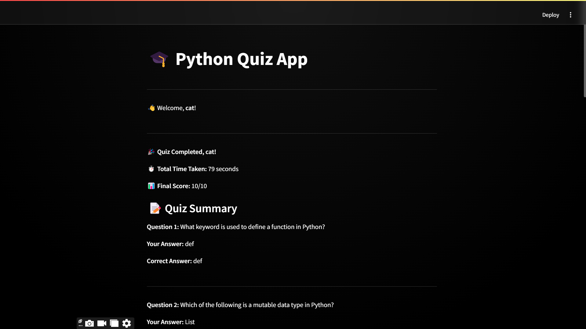

# 🎓 Python Quiz App  

A **dynamic and interactive** Python quiz application built using **Streamlit**. This app allows users to test their **Python knowledge**, choose difficulty levels, and view their scores with a stylish **neon cyberpunk UI**.  

## 🌟 Features  

✅ **User Login:** Enter your name to start the quiz.  
✅ **Difficulty Levels:** Choose from **Easy, Medium, or Hard** questions.  
✅ **Multiple Choice Questions:** Select answers from given options.  
✅ **Progress Bar:** Tracks quiz completion.  
✅ **Real-Time Timer:** Displays total time taken to complete the quiz.  
✅ **Instant Feedback:** Shows whether an answer is **correct or incorrect**.  
✅ **Final Score & Summary:** Displays results with a **leaderboard**.  
✅ **Stylish Dark Neon Theme:** Cyberpunk-inspired UI with **glow effects**.  

---

## 📸 Screenshots  

### 🎭 **Home Page**  
  

### 🎯 **Quiz in Progress**  
  

### 🏆 **Final Score & Summary**  
  

---

## 🚀 Installation & Setup  

### 1️⃣ **Clone the Repository**  
```bash
git clone https://github.com/muzaffar401/Advance_Quiz_App.git
cd Advance_Quiz_App
```

### 2️⃣ **Create Virtual Environment**  
```bash
python -m venv venv  
source venv/bin/activate   # For macOS/Linux  
venv\Scripts\activate      # For Windows  
```

### 3️⃣ **Install Dependencies**  
```bash
pip install -r requirements.txt
```

### 4️⃣ **Run the App**  
```bash
streamlit run main.py
```

---

## 🛠️ Technologies Used  

- **Python** 🐍  
- **Streamlit** 🚀  
- **HTML & CSS (Custom Styling)** 🎨  
- **Time Module (Timer for Quiz)** ⏳  

---

## 📂 Project Structure  

```
📂 python-quiz-app
│── 📂 assets/           # Images & design assets
│── 📂 data/             # Quiz questions JSON
│── main.py               # Main Streamlit app
│── quiz_data.py         # Quiz questions logic
│── requirements.txt     # Dependencies
│── README.md            # Project documentation
```

---

## 🎭 Custom Styling (Neon Theme)  

The quiz app features a **cyberpunk-inspired** **dark theme** with neon glow effects, custom buttons, progress bars, and modern typography.  

```css
[data-testid="stAppViewContainer"] {
    background: radial-gradient(circle at top, #0f0f0f, #000000 80%);
    color: white;
}
.stButton>button {
    background: linear-gradient(45deg, #ff00ff, #ff0099);
    box-shadow: 0px 0px 8px #ff00ff;
}
```

---

## 🏆 Leaderboard Feature  

- **Stores user scores** and displays them at the end.  
- **Ranks players** based on performance.  
- **Custom styling** for top scores!  

---

## 👨‍💻 Contributing  

1. **Fork the repo** and create a new branch.  
2. Make your changes and **commit with a meaningful message**.  
3. Create a **pull request** and describe your changes.  
4. ⭐ Star the repo if you like it!  

---

## 📜 License  

This project is licensed under the **MIT License**.  

---

## 🤝 Connect  

💻 **GitHub:** [Muzaffar Ahmed](https://github.com/muzaffar401)  
📧 **Email:** ma9400667@gmail.com  
